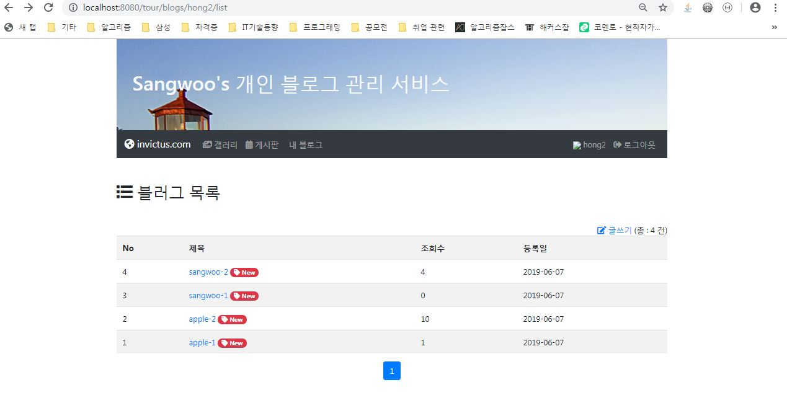

# Blog-Web-Service

## 프로젝트 목적

웹 클라이언트 단과 서버 단 개발 역량을 종합적으로 확인 및 테스트 하기 위한 개인 프로젝트로 네이버 블로그 형식의 회원 가입 / 로그인 / 회원 관리 / 게시판, 블로그 및 갤러리 기능을 구현해보자 하였다. 


## 개발 환경 및 사용 언어

- Eclipse 

- Apache Tomcat 8.5

- HTML [boostrap]

- CSS

- Javascript / jQuery

- Spring Framework

- MyBatis

  

## 기능 요약

1. 회원가입
   - ID와 비밀번호 유효성 검사
   - 회원 이미지 업로드(Multipart 활용)
2. 로그인
3. 회원 정보 수정[일반 유저]
4. 관리자 권한
   - 멀티 회원 삭제 / 게시글 삭제
5. 갤러리 게시글 (등록 / 삭제 / 수정)
   - 스프링 멀티파트를 통한 파일 업로드
   - 페이징 처리
6. 종합 게시글(등록 / 삭제 / 수정)
   - 댓글 기능
   - 페이징 처리
7. 나만의 블로그[수정 중] (등록 / 삭제 / 수정)
   - 타 유저가 볼 수 없음
   - 페이징 처리


## 핵심 코드

1. **예외 처리**

   사용자 정의의 ResultMsg  객체 및 자료구조 Map 을 통한 예외 처리 

   ```java
   // 아이디 유효성 검사
   @GetMapping("/id-check/{userId}")
   @ResponseBody
   public ResponseEntity<ResultMsg> checkId(@PathVariable String userId)
       throws Exception {
       if (service.getMember(userId)==null) {
           return ResultMsg.response("ok", "사용가능한 ID 입니다.");
       } else {
           return ResultMsg.response("duplicate", "이미 사용중인 ID 입니다.");
       }
   }
   ```

   ```java
   // 특정 게시글 삭제 요청 처리 메소드
   @DeleteMapping("/delete/{boardId}")
   @ResponseBody
   public ResponseEntity<Map<String, String>> delete(@PathVariable int boardId, @RequestParam(value = "password") String password) throws Exception {
       Map<String, String> map = new HashMap<>();
       if (service.delete(boardId, password)) {
           map.put("result", "success");
       } else {
           map.put("result", "비밀번호가 일치하지 않습니다.");
       }
       HttpHeaders headers = new HttpHeaders();
       headers.add("Content-Type", "application/json; charset=utf-8");
       return new ResponseEntity<Map<String, String>>(map, headers, HttpStatus.OK);
   }
   ```
   

   
2. **비밀번호 암호화**

   ```java
   public static String getEncrypt(String source, String salt) {
   		String result = "";
   		String temp = source + salt;
   		byte[] bytes = temp.getBytes();
   		try {
   			MessageDigest md = MessageDigest.getInstance("SHA-256");
   			md.update(bytes);
   			byte[] byteData = md.digest();
   			// 바이트를 문자열로 변환
   			StringBuilder sb = new StringBuilder();
   			for (int i = 0; i < byteData.length; i++) {
   				sb.append(String.format("%02x", byteData[i]));
   			}
   			result = sb.toString();
   		} catch (NoSuchAlgorithmException e) {
   			e.printStackTrace();
   		}
   		return result;
   	}
   ```
   

   
3. **타일을 이용한 UI 탬플릿 모듈화**

   ```html
   <body>
   <div class="container">
   	<tiles:insertAttribute name="header"/>
   	<tiles:insertAttribute name="menu"/>
   	<tiles:insertAttribute name="body"/>
   	<tiles:insertAttribute name="footer"/>
   </div>
   </body>
   ```

4. **댓글 구현**

   ```javascript
   class ReplyList {
   	constructor(opt) {
   		this.opt = opt;
   		this.editForm = `
   		<div class="card card-body mp-3"> ... </div>`;
   		this.deleteForm = `
   		<div class="card card-body mp-3"> ... </div>`;
   		$(this.opt.el)
   		.on('click', '.show-reply-add', e=>this.showAdd(e))
   		.on('click', '.show-reply-edit', e=>this.showEdit(e))
   		.on('click', '.show-reply-delete', e=>this.showDelete(e))
   		.on('click', '.reply-ok', e=>this.ok(e))
   		.on('click', '.reply-cancel', e=>this.cancel(e))
   		axios.get(opt.action, {
   			params : {
   				tableName : this.opt.tableName,
   				groupId : this.opt.groupId,	
   			}			
   		})
   		.then(result=>this.makeList(result.data)).catch(console.log)		
   	} ...
   ```
   

   
5. **페이징 처리**

   ```java
   public PageInfo(int currentPage, int total, int perPage, int perBlock) {
   		page = currentPage;
   		this.totalCount = total;
   		this.perPage = perPage;
   		this.perBlock = perBlock;
   		
   		start= (page-1)*perPage+1;
   		end = start + perPage-1;
   		totalPage = (int)Math.ceil((float)total/perPage);	
   
   		currentBlock= (int)Math.ceil((float)currentPage/perBlock);
   		totalBlock = (int)Math.ceil((float)totalPage/perBlock); 
   		
   		startPage = (currentBlock-1)* perBlock + 1;	// 블록 시작 페이지
   		endPage = startPage + perBlock - 1; 		//블록 마지막 페이지
   		
   		if(endPage > totalPage) endPage = totalPage;
   
   		prevBlockPage = page - perBlock;
   		nextBlockPage = page + perBlock;	
   	}
   ```

   

## 주요 기술

1. **Ajax 비동기식 통신**

   ```javascript
   // ID 중복 체크
   self.click(function(){
       var userId = idInput.val();
       if(!userId) return alert('사용자 ID를 입력하세요');
       $.get('id-check/' + userId, function(data){
           if(data.result == 'ok') {
               msgSpan.html(data.message).removeClass('error');
               submitBtn.prop('disabled', false);	// submit 버튼 활성화	
               self.prop('disabled', true);	// ID 체크 버튼 비활성화
           } else {
               msgSpan.html(data.message).addClass('error');
               submitBtn.prop('disabled', true); // submit 버튼 비활성화	
           }
       });	
   });
   ```

2. **Restful API 방식의 데이터 처리**

   ```java
   // 특정 게시글 삭제 요청 처리 메소드
   @DeleteMapping("/delete/{boardId}")
   @ResponseBody
   public ResponseEntity<Map<String, String>> delete(@PathVariable int boardId,
                                                     @RequestParam(value = "password") String password) throws Exception {
       Map<String, String> map = new HashMap<>();
       if (service.delete(boardId, password)) {
           map.put("result", "success");
       } else {
           map.put("result", "비밀번호가 일치하지 않습니다.");
       }
       HttpHeaders headers = new HttpHeaders();
       headers.add("Content-Type", "application/json; charset=utf-8");
       return new ResponseEntity<Map<String, String>>(map, headers, HttpStatus.OK);
   }
   ```

   

   - **행위가 아닌 자원(명사) 위주의 URL 처리**

   </img>

   

3. **스프링 프레임워크 인터셉터**

   로그인 처리 간 효율적 세션관리를 위한 인터셉터 활용

   ```java
   @Component
   public class LoginInterceptor extends BaseInterceptor {
   	@Override
   	public boolean preHandle(HttpServletRequest request, HttpServletResponse response, 		Object handler) throws Exception {
   		HttpSession session = request.getSession();
   		if (session.getAttribute("USER") == null) {
   			System.out.println("로그인이 필요한 서비스입니다.");
   			redirect(request, response, "/login", "로그인이 필요한 서비스입니다.");
   			return false;
   		}
   		return super.preHandle(request, response, handler);
   	}
   }
   ```

   

4. **lombok & builder library**

   - 갤러리 게시판의 이미지들을 업로드할 때 

   ```java
   private void saveImages(Gallery gallery) throws Exception {
       for(MultipartFile file : gallery.getFiles()) {	
           if(file.isEmpty()) continue;
           Image image = Image.builder()
               .galleryId(gallery.getGalleryId())
               .originalName(file.getOriginalFilename())
               .fileSize((int)file.getSize())
               .mimeType(file.getContentType())
               .build();
           imageService.create(image);
           imageService.saveImage(image, file);
       }
   }
   ```
   
5. **제너릭과 상속 및 Static 활용**

   게시글 생성 / 삭제 / 수정 / 목록 출력 DAO 를 CrudDao 라는 공통 모듈을 이용하여 구현

   ```java
   public interface BoardDao extends CrudDao<Board, Integer> {
   	final static String PAGING_SUBQUERY = 
   	"select  row_number() over (order by board_id desc) as seq, board.* fromboard";
       ...  
   	public static class BoardSQL{
   		public static String insert(Board board) {
   			return new SQL() {{
   				INSERT_INTO("board");
   				VALUES("board_id", "BOARD_SEQ.NEXTVAL");
   			    VALUES("title, writer, password, content", 
   			    	"#{title}, #{writer}, #{password}, #{content}");			    
   			  }}.toString();	
   		}
   	}	
   ```

   

6. **JSTL 과 EL** 

   게시글 리스트 출력

   ```html
   <c:forEach var="board" items="${pi.list}">
       <tr><td>${board.boardId}</td>
           <td> <a href="view/${board.boardId}?page=${pi.page}"> ${board.title}
               <iot:newToday test="${board.regDate}"/></a></td>
           <td>${board.writer}</td>
           <td>${board.readCnt}</td>
           <td><fmt:formatDate value="${board.regDate}" pattern="yyyy-MM-dd"/></td>
       </tr></c:forEach>
   ```

   

7. **이미지 업로드를 위한 멀티파트 활용**

   ```html
   <form:form modelAttribute="gallery" enctype="multipart/form-data"> ...</form:form>
   ```

   - mvcconfig.java (스프링 설정)

     ```java
     @Bean
     public CommonsMultipartResolver multipartResolver() {
         CommonsMultipartResolver resolver = new CommonsMultipartResolver();
         resolver.setDefaultEncoding("utf-8");
         return resolver;
     }
     ```

     

## 주요 패키지 및 클래스 설명

### java

#### 		controller : 스프링 컨트롤러

​				**BoardController** : 게시글 관리 컨트롤러

​				**PostController** : 블로그 관리 컨트롤러

​				**GalleryController** : 갤러리 관리 및 이미지 업로드 컨트롤러

​				**MemberController** : 회원 가입 및 일반 유저 회원 정보 수정 컨트롤러

​				**AdminController** : 관리자 권한의 회원 및 게시글 관리 컨트롤러

​				**LoginController** : 로그인 관리 컨트롤러

​				**AvataController** : 업로드된 이미지 출력 컨트롤러

​				**ReplyController** : 댓글 관리 컨트롤러

#### 		dao : 스프링 DAO

​				스프링 service 로 부터 요청받은 기능을 수행하기 위한 dao 자바 파일로 구성.

#### 		domain : 스프링 DTO

​				avata.java / blog.java / board.java / galler.java / post.java / reply.java / image.java / loginInfo.java

​				**fileInfo.java** : 게시글에 업로드 될 파일 하나의 정보를 위한 DTO

​				**pageInfo.java** : 페이징 처리와 요청 페이지에 맞는 리스트 출력을 위한 DTO

​				**resultMsg.java** : 각 종 예외 처리를 위한 객체 DTO(결과와 메시지로 구성)

​				**userLevel.java** : 회원 별 등급 정보 DTO				

#### 		interceptor : 스프링 인터셉터

​				**BaseInterceptor** : 인터셉터 기본 기능 설정

​				**LoginInterceptor** / **AdminInterceptor** : 일반 유저 및 관리자 로그인 시 세션관리를 위한 인터셉터

#### 		service : 스프링 service

​				컨트롤러로 부터 요청받은 기능을 수행하기 위한 인터페이스와 구현 파일로 구성.

#### 		config : 스프링 설정 폴더

​				DatabaseConfig.java / MvcConfig.java / RootConfig.java / WebAppInitializer.java

#### 		util : 각 종 기능 구현을 보조하는 유틸리티 폴더

​				**ImageUtil.java / ThumbUtil.java** : 바이트 단위의 파일 업로드 처리

​				**ResponseMsg.java** : Restful API 방식의 데이터 처리를 출력하는 공통 모듈

​				**SHA256Util.java** : 비밀번호 암호화 처리

### resources :  DB 설정 및 Mapper 폴더

### webapp : UI 폴더

#### 		resources

​				**bower_components** : axios / tinymice 라이브러리		

​				**css** : css 폴더

​				**images** : 이미지 폴더

​				**js** : javascript 폴더

#### 		views

​				**layouts** : header, menu, body, footer UI 를 구성하는 공통 UI 모듈

​				**board** : 종합 게시글 관리 폴더(list.jsp, edit.jsp, view.jsp, create.jsp)

​				**gallery** : 갤러리 게시글 관리 폴더(list.jsp, edit.jsp, view.jsp, create.jsp)

​                **post** : 블로그 게시글 관리 폴더(list.jsp, edit.jsp, view.jsp, create.jsp)

​			    **member** : 로그인과 회원가입, 회원정보 수정 관리 페이지 폴더

​				**admin** : 관리자 페이지 정보 폴더


## 주요 기능

#### 1. 회원 가입

------

</img>


#### 2. 로그인

------

</img>


#### 3. 회원정보 수정

------

</img>


#### 4. 회원 관리 (**관리자 권한**, 회원 정보 수정 및 다중 삭제 기능 포함)

------

</img>


#### 5. 블로그 관리[**수정 중..**.]

------

</img>


#### 6. 갤러리 게시판 

------

</img>


#### 7. 종합 게시판

------

</img>


#### 8. 댓글

------

</img>

#### 

#### 9. 나만의 블로그[수정 중...]

------

</img>

